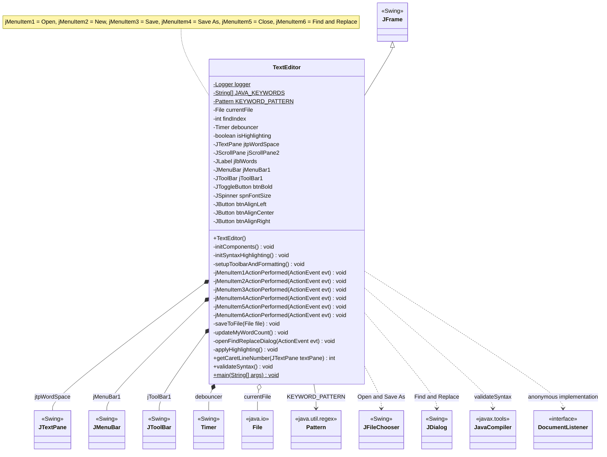

```mermaid
classDiagram
    class JFrame {
        <<Swing>>
    }

    class TextEditor {
        -Logger logger$
        -String[] JAVA_KEYWORDS$
        -Pattern KEYWORD_PATTERN$
        -File currentFile
        -int findIndex
        -Timer debouncer
        -boolean isHighlighting
        -JTextPane jtpWordSpace
        -JScrollPane jScrollPane2
        -JLabel jlblWords
        -JMenuBar jMenuBar1
        -JToolBar jToolBar1
        -JToggleButton btnBold
        -JSpinner spnFontSize
        -JButton btnAlignLeft
        -JButton btnAlignCenter
        -JButton btnAlignRight
        +TextEditor()
        -initComponents() void
        -initSyntaxHighlighting() void
        -setupToolbarAndFormatting() void
        -jMenuItem1ActionPerformed(ActionEvent evt) void
        -jMenuItem2ActionPerformed(ActionEvent evt) void
        -jMenuItem3ActionPerformed(ActionEvent evt) void
        -jMenuItem4ActionPerformed(ActionEvent evt) void
        -jMenuItem5ActionPerformed(ActionEvent evt) void
        -jMenuItem6ActionPerformed(ActionEvent evt) void
        -saveToFile(File file) void
        -updateMyWordCount() void
        -openFindReplaceDialog(ActionEvent evt) void
        -applyHighlighting() void
        +getCaretLineNumber(JTextPane textPane) int
        +validateSyntax() void
        +main(String[] args)$ void
    }

    note for TextEditor "jMenuItem1 = Open, jMenuItem2 = New, jMenuItem3 = Save, jMenuItem4 = Save As, jMenuItem5 = Close, jMenuItem6 = Find and Replace"

    class JTextPane {
        <<Swing>>
    }
    class JMenuBar {
        <<Swing>>
    }
    class JToolBar {
        <<Swing>>
    }
    class JFileChooser {
        <<Swing>>
    }
    class JDialog {
        <<Swing>>
    }
    class Timer {
        <<Swing>>
    }
    class DocumentListener {
        <<interface>>
    }
    class JavaCompiler {
        <<javax.tools>>
    }
    class File {
        <<java.io>>
    }
    class Pattern {
        <<java.util.regex>>
    }

    JFrame <|-- TextEditor
    TextEditor *-- JTextPane : jtpWordSpace
    TextEditor *-- JMenuBar : jMenuBar1
    TextEditor *-- JToolBar : jToolBar1
    TextEditor *-- Timer : debouncer
    TextEditor o-- File : currentFile
    TextEditor --> Pattern : KEYWORD_PATTERN
    TextEditor ..> JFileChooser : Open and Save As
    TextEditor ..> JDialog : Find and Replace
    TextEditor ..> JavaCompiler : validateSyntax
    TextEditor ..> DocumentListener : anonymous implementation
```
